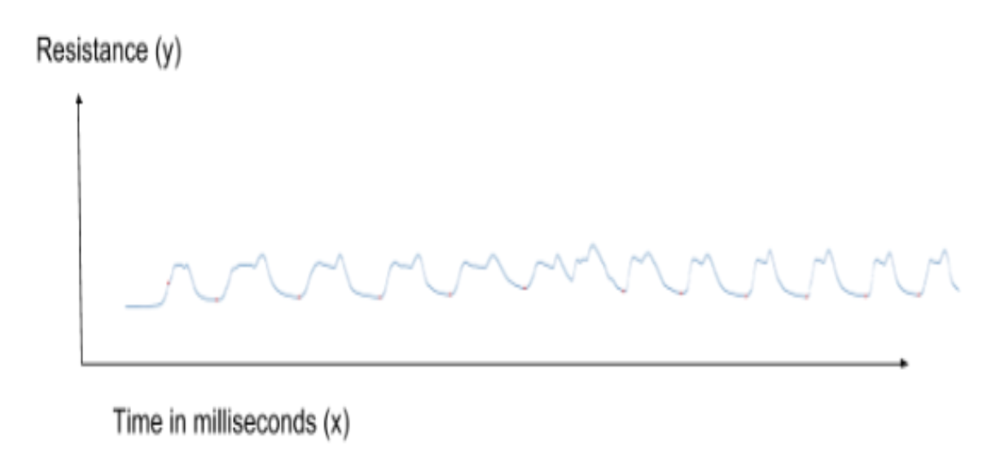
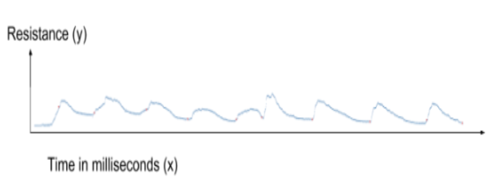
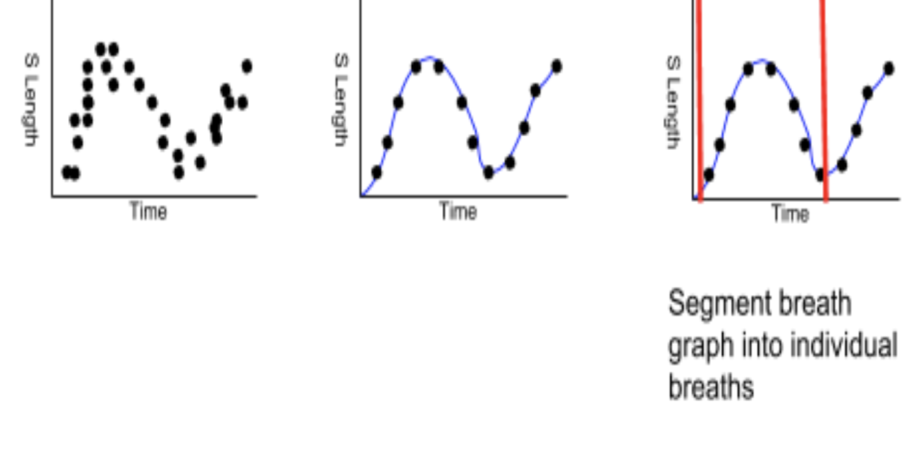
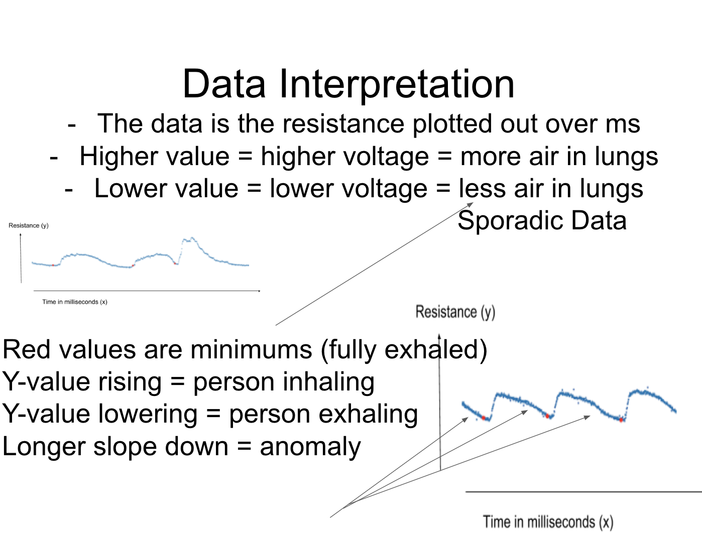
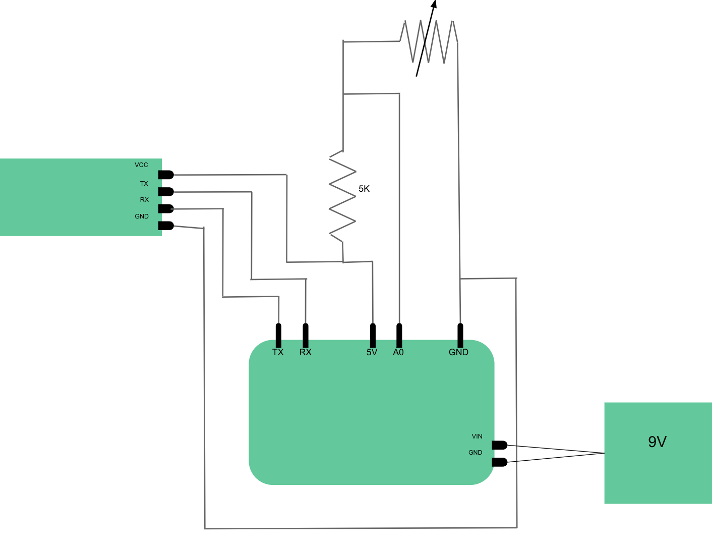
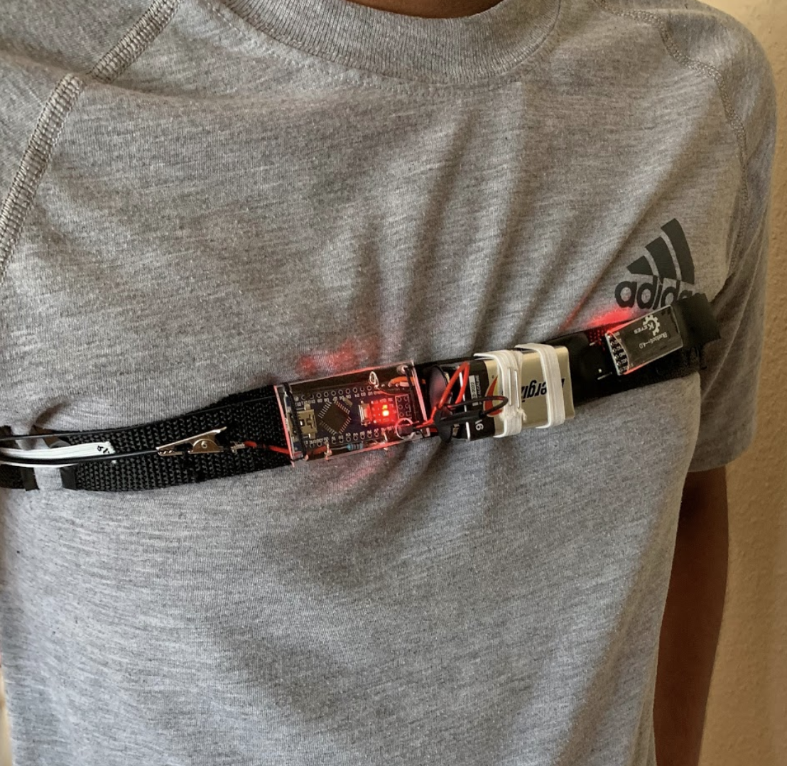
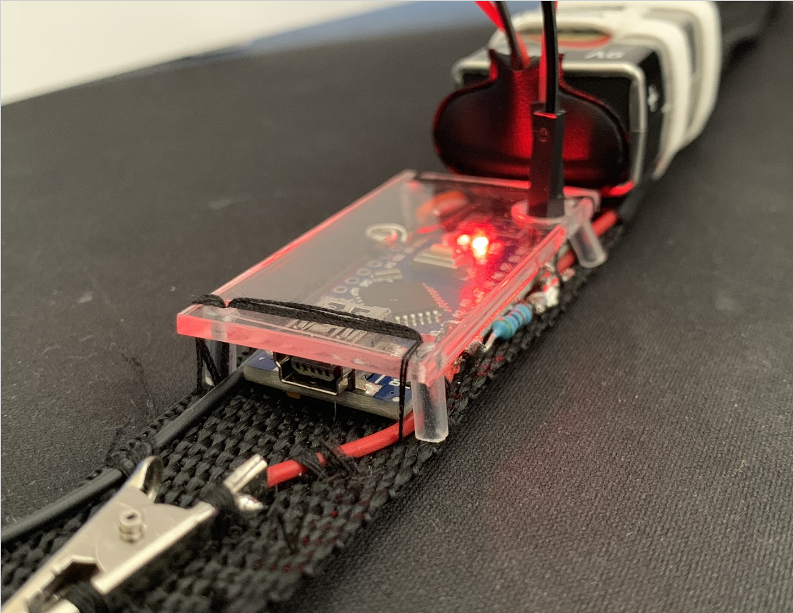
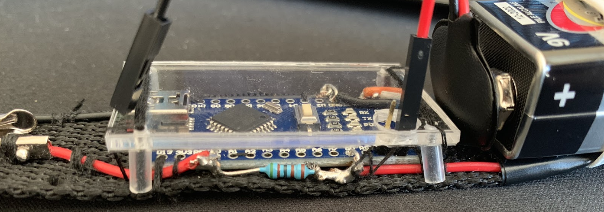

# Synopsys Silicon Valley Championship

## Asthma Aid
**Grand Prize Student Award Recipients**

*Asthma diagnosis and progression tracking through the use of non-intrusive wearable technology and respiratory analysis.*

[Link to Engineering Notebook](docs/engineeringNotebook.pdf)

## Asthma?
- Causes difficulty of breathing
- Affects 20 million lives across all age ranges
- Currently, the only way to track asthma is a peak flow meter . This requires the user to blow into the meter and manually track. 

## Engineering goal
- Design a passive, non-intrusive abdominal strap that:
  - Constantly monitors your breathing
  - Tracks respiratory patterns constantly
  - Processes data
  - Detects anomalies in breathing patterns
  - Presents information to the patient and their doctor automatically.

## What is our implementation based off?
- When people are having an asthma attack, they have certain breathing patterns which are central to our project. They inhale quickly and exhale slowly.
- Normal breathing:

- Asthmatic breathing:

## How does this implementation work?
- Here is the data processing pipeline, visualized

## Software pipeline
1. **Data** --> *Parse the data set for the dataframes. Get the type of data, file sizes, read the data, and copy it into various dataframes.*
2. **Params** --> *Gather hyperparameters passed in by the user. Adapt as needed and calculate other values based on these parameters.*
3. **Starting** --> *Get the starting point of the breaths using a cluster removal algorithm and standard deviation measurements.*
4. **Main** **Points** --> *Gather interesting points based on slope calculations. Remove clusters, similar values, false min/maxes, null values. *
5. **Segmentation** --> *At each minimum value, separate the data. Create individual segments for each breath, then discard end data.*
6. **Plotting** --> *Plot the individual segments for visualization. Plot the overall graph of the entire section of breathing. Save to OS.*
7. **Anomalies** --> *Detect anomalies, which is where the person takes a substantially longer time to exhale. Find anomalies, return locations, and plot.*

## How is the data measured?
1. The data is measured every 10ms by the analog input in the arduino nano.
2. As the resistance to the band increases (inhale), the volt output increases; the opposite happens for an exhale.
3. The data is transmitted via an HM10 bluetooth module over a transmitting signal to the phone
4. The data is finally uploaded to PyreBase, sent to the server

## Hardware images

**Hardware diagram**

**Hardware on body**

**Pictures of the hardware**

## Contributors
- **Pranav Eranki** - Python / Notebook 
- **Shashank Venkatramani** - Hardware / iOS
